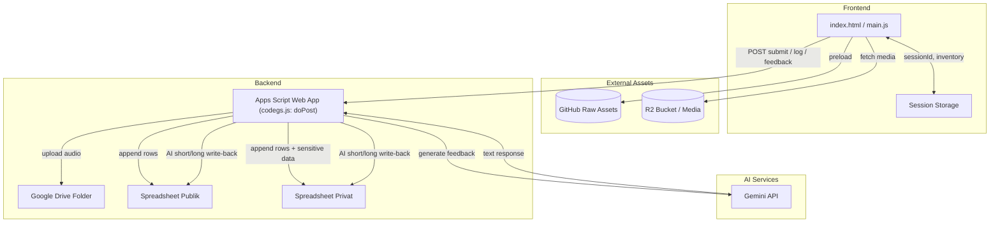

# Survey HTH – Frontend & Apps Script Overview

## 📦 Struktur Folder

```
shareable/
├── index.html          # Halaman utama SPA
├── style.css           # Styling utama termasuk animasi gacha
├── main.js             # Logika frontend, UI wizard, gacha, rekaman audio
└── codegs.js           # Google Apps Script (backend) untuk form submit
```

> **Catatan**: Versi ini tidak memuat API key, ID spreadsheet, ataupun kredensial. Gantilah placeholder di `main.js` dan `codegs.js` sebelum deploy.

## 🛠️ Tech Stack & Library

### Frontend

- **Vanilla HTML/CSS/JS** – Membentuk wizard multi-step tanpa framework tambahan.
- **Chart.js** – Menampilkan radar chart Circle of Life dan memperbarui dataset setiap pergeseran slider.
- **GSAP** – Menghandle transisi antar halaman (fade/slide) serta animasi popup.
- **Howler.js** – Manajemen audio untuk musik latar, efek slider, serta efek gacha.
- **FingerprintJS v3** – Mengambil ID unik browser untuk mendeteksi pola submit mencurigakan.
- **Howler audio assets** – Di-host di GitHub (tetap aman dibagikan).

### Backend (Google Apps Script)

- **Apps Script Web App** – `codegs.js` menerima request POST dari frontend, menyimpan data ke Google Sheets, dan mengunggah audio ke Google Drive.
- **Google Drive API (Apps Script)** – Menyimpan rekaman suara dalam folder target.
- **Google Sheets API (Apps Script)** – Menyimpan ringkasan data ke dua spreadsheet: publik dan privat.
- **Gemini API** – Opsional, men-generate pesan motivasi singkat bagi peserta.

## 🔐 Identitas & Anti-Submit Spam

Dua parameter tambahan dikirimkan saat submit: `browserId` (dari FingerprintJS) dan `ipAddress` (melalui layanan IP publik). Keduanya disiapkan agar backend dapat mengenali pola submit ganda yang mencurigakan. Flow sanitasi dan penyimpanan sudah disiapkan di `codegs.js`, sehingga developer dapat menambahkan logika pembatasan sesuai kebutuhan tanpa perlu merombak struktur data.

## 🧭 Arsitektur & Routing Antar Komponen



### Skema Detail

1. **Static Hosting (Frontend)**

   - `index.html`, `style.css`, dan `main.js` dipublikasikan di hosting statis (misal Firebase Hosting atau Cloudflare Pages).
   - Saat halaman dimuat, `main.js` melakukan preload aset video/audio dari GitHub raw dan R2 tanpa autentikasi tambahan.

2. **Data Session & Fingerprint**

   - Frontend menyimpan inventori gacha dan `sessionId` di SessionStorage untuk mengikat tindakan pengguna selama sesi.
   - FingerprintJS menghasilkan `browserId` unik; dikirim ke backend untuk membantu mitigasi spam bersama `ipAddress` yang diambil via layanan IP publik.

3. **Apps Script Web App (`codegs.js`)**

   - Endpoint utama menerima request dengan variasi `action`:
     - _Submit utama_ (tanpa `action`): payload lengkap skor, cerita, audio.
     - `logGachaPull`: mencatat hasil gacha ke sheet privat.
     - `geminiFeedback`: meminta pesan AI tambahan setelah submit sukses.
   - Setiap submit utama menghasilkan `reqId` unik (UUID) yang dikembalikan ke frontend untuk sinkronisasi permintaan AI.

4. **Interaksi dengan Google Drive & Sheets**

   - Audio (Base64) di-decode dan diunggah ke Drive folder `FOLDER_ID`, kemudian dipublikasikan jika `AUDIO_PUBLIC=true`.
   - Dua spreadsheet:
     - **Publik** – berisi data non-sensitif + link audio + kolom AI.
     - **Privat** – menambahkan `browserId`, `ipAddress`, dan log gacha.
   - Fungsi `_backfillReqIdInGachaLog` dan `_backfillMemberInGachaLog` memastikan entri gacha yang datang lebih awal tetap terhubung dengan baris submit resmi.

5. **AI Feedback (Gemini)**

   - `handleGeminiFeedback` menyusun prompt berdasarkan skor, cerita, dan profil coach.
   - Jika API key tersedia, request dikirim ke Gemini; jika tidak, fallback template manual digunakan.
   - Hasil (short/long) ditulis kembali ke kedua sheet sehingga frontend bisa menampilkan pesan langsung tanpa memanggil AI ulang.

6. **Logging & Monitoring**
   - Versi shareable telah menonaktifkan `Logger.log`/`console.log` non-esensial untuk menjaga kebersihan output.
   - Developer dapat menghidupkan logging di versi internal untuk audit.

## 📬 Payload Utama Frontend → Backend

```jsonc
{
  "coach": "Master Nads",
  "anggota": "Aqeela",
  "browserId": "FINGERPRINT_ID",
  "sessionId": "SESSION_TOKEN",
  "ipAddress": "203.0.113.10",
  "audioData": "BASE64_WEBM",
  "audioMimeType": "audio/webm",
  "happyStory": "Cerita bahagia",
  "sadStory": "Cerita sedih",
  "Health": 7,
  "Academic": 8,
  "Family": 6,
  "Friends": 7,
  "Religion": 9,
  "Organization": 8,
  "SelfLove": 7,
  "Learning": 8,
  "Finances": 6,
  "Spirit": 8
}
```

Backend membalas:

```json
{
  "status": "success",
  "reqId": "UUID",
  "ms": 1320
}
```

> `reqId` digunakan untuk menyambungkan data AI feedback serta log gacha.

## 🧮 Spreadsheet & Drive

Kedua lembar (`PUBLIC_SHEET_ID`, `PRIVATE_SHEET_ID`) wajib diisi manual dengan ID asli:

- **Sheet Publik** – Tanggal, coach, anggota, link audio, 10 skor, dua kolom AI.
- **Sheet Privat** – Termasuk `browserId`, `ipAddress`, dan data sensitif lain.
- **Folder Drive** – Id yang berisi rekaman `.webm` hasil submit.

## 🎮 Gacha & Inventory

- Aset gacha dipreload via GitHub raw links.
- Inventory disimpan di `sessionStorage` agar tidak bercampur antar sesi.
- Setiap `Pull` menuliskan log ke tab `GachaItemLog` di spreadsheet privat.

## 🧠 Gemini Feedback

- Request dikirim via `action: "geminiFeedback"`.
- `codegs.js` memanggil model Gemini (atau fallback template) lalu menulis hasil ke sheet.
- Opsi _“Lebih mendalam lagi”_ meminta versi lebih panjang (depth = `long`).

## 📝 Langkah Deploy Singkat

1. **Set placeholder** di `shareable/codegs.js` & `shareable/main.js`:
   - `FOLDER_ID`
   - `PUBLIC_SHEET_ID`
   - `PRIVATE_SHEET_ID`
   - `WEB_APP_URL` (link ke Apps Script Web App yang sudah dideploy)
2. **Script Properties** di Apps Script:
   - `GEMINI_API_KEY` (jika menggunakan AI)
   - `AUDIO_PUBLIC` – `true|false` untuk share link drive
3. **Deploy Apps Script** sebagai Web App (akses Anyone).
4. **Hosting** frontend: cukup unggah `index.html`, `style.css`, `main.js` ke hosting mana pun (Firebase, Netlify, Cloudflare Pages, dsb.).

## 💡 Tips Pengembangan Lanjut

- Tambahkan validasi anti-spam di `codegs.js` berdasarkan `browserId`/`ipAddress` + `sessionId`.
- Jika ingin menghindari bergantung pada GitHub raw, pindahkan aset ke hosting internal.
- Untuk debug, gunakan `Utilities.log`/`Console.log` secukupnya di versi internal, sementara versi shareable sudah dibersihkan.
- Pertimbangkan menambahkan rate limit/honeypot sederhana di frontend untuk menekan bot.

---
