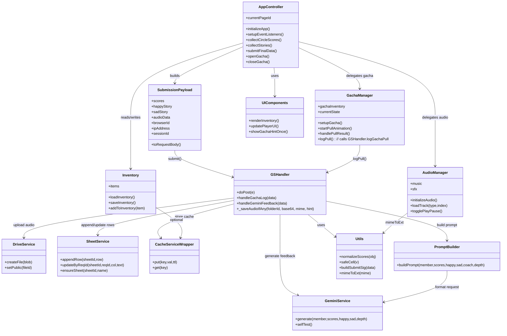
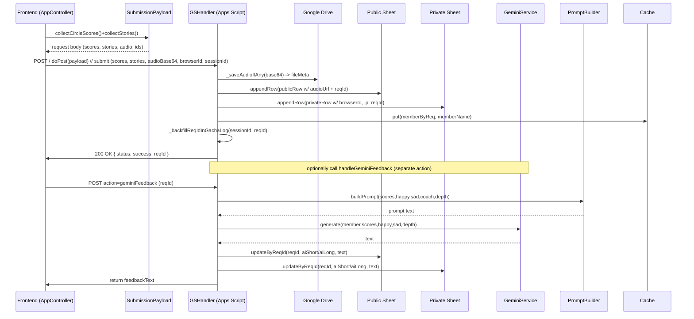
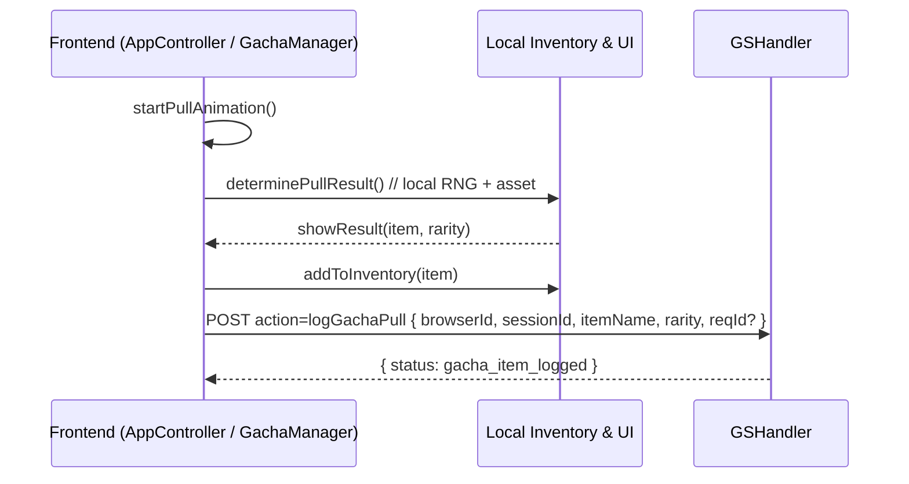

# OOP-style Architecture (Mermaid UML)

This document models the codebase as a set of logical classes and services using Mermaid diagrams. The project is primarily functional/imperative JS, but the diagrams below translate modules and responsibilities into OOP concepts to make architecture, boundaries, and interactions clearer for maintainers.

Class names are logical groupings that map to files (see mapping table below).

---

## Class Diagram

---

> Notes:
> - `SubmissionPayload` is a conceptual wrapper for the object built in `submitFinalData` before making the POST request; it holds Circle of Life scores, happy/sad stories, audio, and identifiers.
> - `GSHandler` represents the Apps Script backend (implements `doPost`, audio save helpers, gacha logging, and Gemini feedback helpers) in `shareable/codegs.js`.
> - `PromptBuilder` encapsulates the prompt that combines scores + stories before calling Gemini inside `handleGeminiFeedback`.

## Sequence: Submission Flow (simplified)

---

## Sequence: Gacha Pull Flow

---

## Class → File Mapping (practical)

- AppController → `shareable/main.js` (functions: initializeApp, setupEventListeners, submit flows)
- GachaManager → `shareable/main.js` (functions: setupGacha, startPullAnimation, handle results)
- AudioManager → `shareable/main.js` (initializeAudio, loadTrack, togglePlayPause)
- Inventory → `shareable/main.js` (sessionStorage helpers: loadInventory, saveInventory, addToInventory)
- SubmissionPayload → `shareable/main.js` (object assembled in `submitFinalData` before POST; holds scores, stories, audio, ids)
- UIComponents → `shareable/main.js` (renderInventory, UI helpers)
- GSHandler → `shareable/codegs.js` (doPost, handleGeminiFeedback, handleGachaLog)
- DriveService → `shareable/codegs.js` (encapsulated in \_saveAudioIfAny)
- SheetService → `shareable/codegs.js` (\_mustSheet, \_appendRowSafe, \_updateAiFeedbackByReqId)
- CacheServiceWrapper → `shareable/codegs.js` (CacheService.getScriptCache usage)
- PromptBuilder → `shareable/codegs.js` (`handleGeminiFeedback` builds prompts combining scores + stories)
- GeminiService → `shareable/codegs.js` (callGemini\_, geminiFeedbackSelfTestAll)
- Utils → `shareable/codegs.js` and `shareable/main.js` (normalizeScores*, safeCell*, mimeToExt*, buildSubmitSig*)

---

## Guidance & Notes

- This OOP mapping is conceptual: the codebase uses functions/closures rather than classes. The diagram groups related functions into logical classes to aid understanding and onboarding.
- If you want a real refactor into ES6 classes/modules, I can scaffold class wrappers for each logical unit (e.g., `class GachaManager { ... }`) and add unit tests.
- To render Mermaid locally: GitHub, VS Code Mermaid Preview, or mermaid.live work well. The diagrams in this file use standard Mermaid classDiagram & sequenceDiagram syntax.

---
